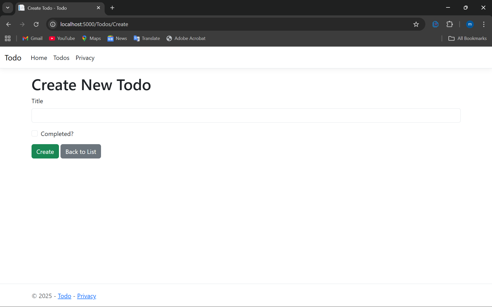
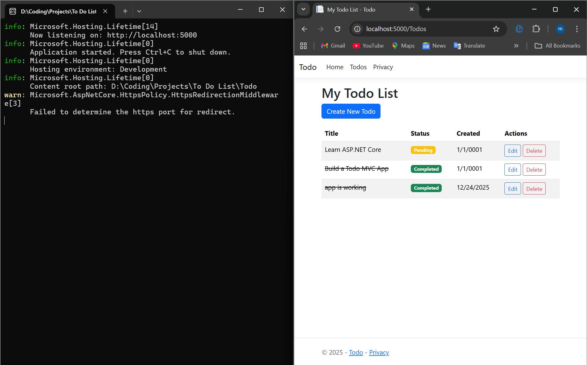
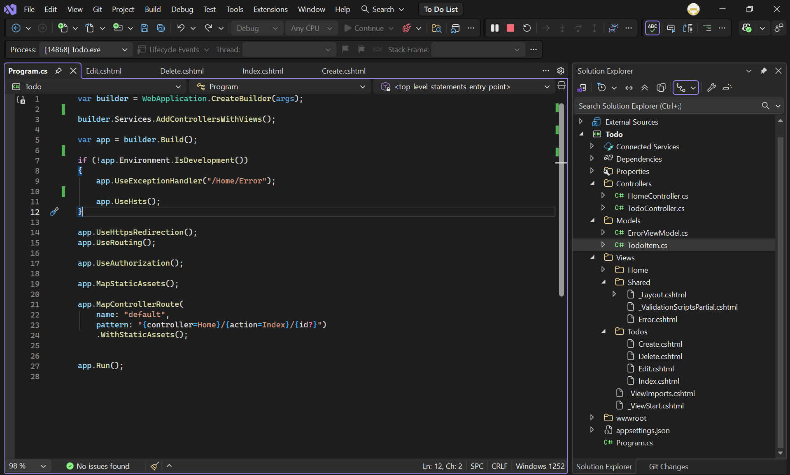

# Todo List Web App

A simple, clean, and fully functional Todo list application built with **ASP.NET Core MVC** (.NET 8 or later).

This project demonstrates core MVC concepts including controllers, models, views, routing, and Bootstrap styling.

## Features

- Create new todos
- Edit existing todos
- Mark todos as completed
- Delete todos
- Responsive design using Bootstrap
- In-memory storage (easy to extend with Entity Framework + database)

## Screenshots




*(Add your own screenshots later by creating a `screenshots` folder and placing images there)*

## How to Run

### Prerequisites
- [.NET 8 SDK](https://dotnet.microsoft.com/download) or later
- Visual Studio 2022 (recommended) or any code editor

### Steps
1. Clone the repository:
   ```bash
   git clone https://github.com/YOUR-USERNAME/YOUR-REPO-NAME.git
